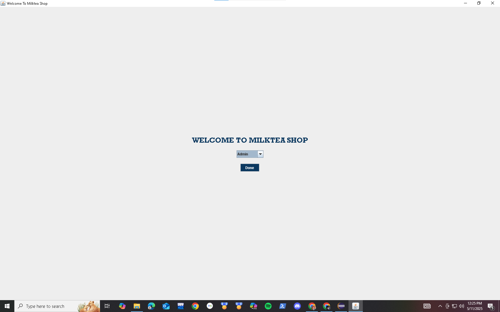
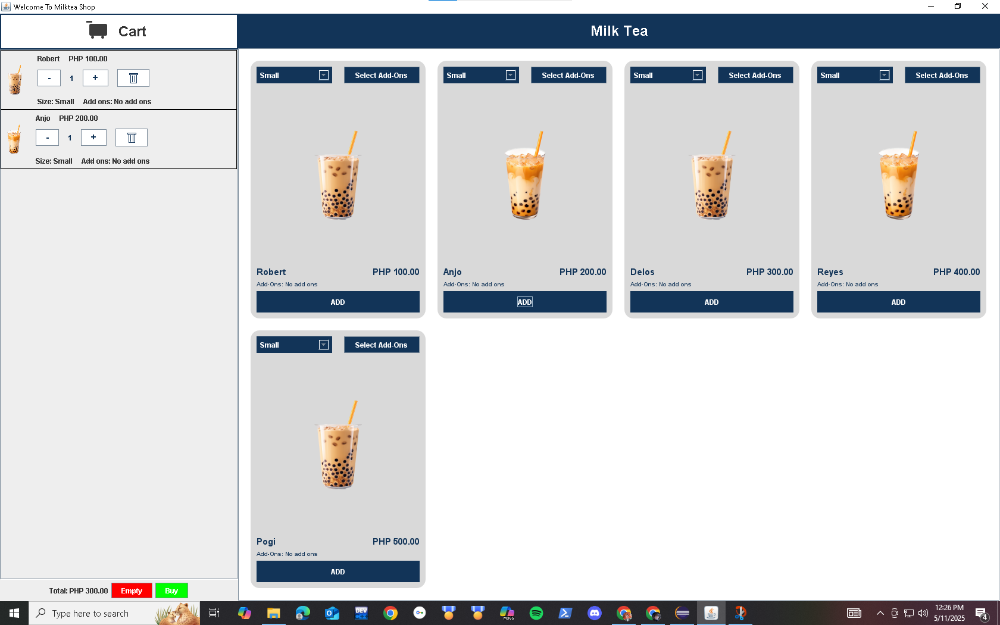

# 🧋 Milk Tea Shop Kiosk - Java Application

A standalone Java-based Milk Tea Shop Kiosk system designed for small businesses. This kiosk allows customers to browse, customize, and order milk tea drinks with an intuitive graphical interface.

## 📌 Features

- 🍵 Choose milk tea flavors and sizes
- 🧊 Add toppings (e.g., pearls, Nata de Coco, Crushed Oreos)
- 🧾 Order summary and bill calculation
- 🎨 Simple Java Swing GUI 

## 🛠️ Technologies Used


- **Java**
- **Object-Oriented Programming**
- **Mysql** 
- **Maven**

## 📷 Screenshots

<!-- Include images of your kiosk UI here -->



## 🚀 How to Run

### Prerequisites

- Java Development Kit (JDK) 8 or higher
- Java IDE (e.g., IntelliJ IDEA, Eclipse) or a terminal/command prompt

### Steps

1. Clone the repository:

   ```bash
   git clone https://github.com/N4chtF4ust/MilkTea.git
   cd MilkTea
